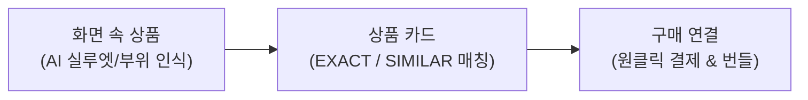
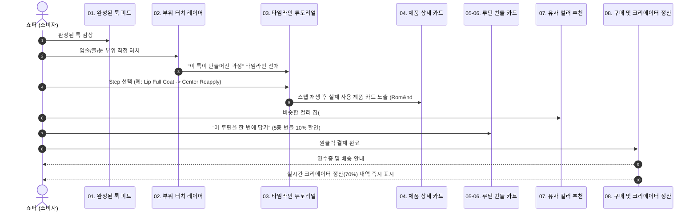
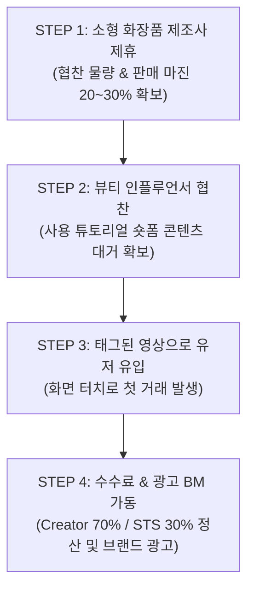
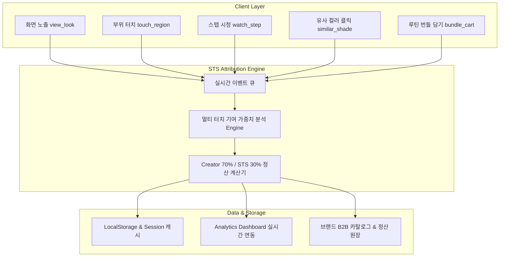

# STS (See it. Tap it. Shop it.)
## 서비스 마스터플랜 및 아키텍처 고도화 보고서 (IR 2026 Master Plan)

> **"사진과 영상 속 상품을 AI가 찾아 바로 구매로 연결합니다."**  
> 콘텐츠에서 발견한 그 상품을 검색 없이 화면에서 바로 구매하는 크리에이터 커머스 쇼핑 연결 레이어

---

## 1. Executive Summary & 비전 (Vision)

STS는 SNS 콘텐츠와 전자상거래(E-Commerce) 사이의 분절된 경험을 연결하는 **비주얼 커머스 인터페이스 레이어(Visual Commerce Layer)**입니다.
기존 소비자는 인스타그램, 틱톡, 유튜브 등에서 매력적인 룩이나 메이크업을 발견(Discovery)하더라도 상품명을 알지 못해 네이버나 구글 검색창으로 이탈하며, 검색 결과에서 엉뚱한 제품을 사거나 구매를 포기합니다.

STS는 독자적인 AI 안면·객체 정밀 세그멘테이션과 실시간 상품 매칭 엔진을 통해, 소비자가 **"보는 즉시, 터치하고, 바로 구매(See it. Tap it. Shop it.)"**할 수 있도록 구현합니다.

---

## 2. 팀 구성 및 실행 역량 (Team & Moat)

| 구분 | 성명 | 역할 | 핵심 경력 및 담당 업무 |
| :--- | :--- | :--- | :--- |
| **공동대표** | **임현수** | 개발 총괄 (CTO) | • KAIST Overedge 1기<br>• unifoli 창업 및 운영<br>• STS 제품·AI 인식 모델·플랫폼 엔지니어링 전체 총괄 |
| **공동대표** | **류현준** | 마케팅 총괄 (CMO) | • MARU BINU AI 창업<br>• KAIST Overedge 의료 스타트업 narrow 창업<br>• 뷰티 제조사·크리에이터 제휴 및 동남아 시장 진입 총괄 |
| **자문/멘토** | **장동인 교수** 외 | 기술/경영/패션 자문 | • KAIST 장동인 교수 (AI/클라우드 기술 검증)<br>• 서울패션허브 센터장 (패션·유통 네트워크)<br>• 봄봄/플립션/우수한 대표 (스타트업 경영 자문)<br>• 정화예술대 정영국 교수 (뷰티/브랜딩 검증) |

---

## 3. 핵심 문제 정의 (The Problem) & STS 솔루션

### 기존 커머스의 3대 페인포인트 (Pain Points)
1. **크리에이터 (Creators)**: 
   - 영상을 제작한 후 제휴 상품 링크를 일일이 찾아 복사하고 설명란/프로필 링크 트리에 붙이는 비효율 발생 (창작 집중 방해).
2. **쇼퍼 (Shoppers)**:
   - 영상 속 제품이 궁금해도 키워드를 유추해 검색창에 타이핑해야 하며, 구매 타이밍(Impulse Moment)을 상실.
3. **브랜드/제조사 (Brands)**:
   - 영상 내 어떤 장면의 어떤 부위(입술, 볼, 눈 등)가 실제 구매 의도를 촉발했는지 데이터가 없어 마케팅 예산 최적화 불가.

### STS의 3단계 구매 여정 혁신 (3-Step Solution)

- **화면 위 1단계 전환**: 검색창으로 이탈할 필요 없이 영상 화면 터치 한 번으로 공식 판매처 및 인앱 결제 도달.

---

## 4. 기술적 해자 (Technology Moat)

단순한 네모 박스(Bounding Box) 객체 인식을 넘어, **실제 제품의 외곽 실루엣과 안면 5대 세부 부위를 초정밀 분할**합니다.

```
[비교]
1. 기존 검색 방식: 대략적인 사각 박스(Bounding Box) -> 배경, 머리카락 혼입으로 오인식 다수
2. STS AI 방식: 정밀 폴리곤 세그멘테이션 (Silhouette & Face Landmark Mesh) -> 96% 분할 정확도
```

- **핵심 벤치마크 지표**:
  - **상품 인식률 (Recall)**: **86%** (22개 테스트셋 중 19개 완벽 식별)
  - **상품 영역 분할 정확도 (Segmentation Accuracy)**: **96%**
  - **안전장치 3단계 (3-Tier Reliability)**:
    - 1단계 서버 AI 검증 (MediaPipe + TensorFlow 고정밀 분석)
    - 2단계 온디바이스 엣지 경량화 캐싱 (모바일 웹 60fps 보장)
    - 3단계 크리에이터 인간 검수 (Human-in-the-Loop)로 무결점 보장

---

## 5. 경쟁 우위 및 STS 웨지 (Competition & STS Wedge)

| 플랫폼 | 주요 단위 | 상품 연결 방식 | 크리에이터 수익화 | 상품 단위 구매 데이터 |
| :--- | :--- | :--- | :--- | :--- |
| **Pinterest** | 핀 / 아이디어 | 수동 태그 카탈로그 | 간접 수익 (광고) | 부분적 |
| **LTK** | 크리에이터 샵 | 수동 외부 링크 | 제휴 수수료 | 없음 |
| **TikTok Shop** | 인앱 숏폼 | 플랫폼 내부 폐쇄몰 태그 | 강함 (인앱 전용) | 플랫폼 내부 독점 |
| **Google Lens** | 시각 이미지 | 범용 검색 매칭 | 없음 | 검색 로그 수준 |
| **STS** | **화면 속 객체/부위** | **자동 AI 세그멘테이션 + 크리에이터 확인** | **실시간 70:30 수익 배분** | **초정밀 장면·부위 데이터 (핵심 자산)** |

> **STS WEDGE**:  
> TikTok Shop은 자사 앱 안의 상품만 거래 가능하고, LTK는 외부 링크 복사에 머뭅니다.  
> **STS는 사용자와 크리에이터가 플랫폼을 이주(Migration)할 필요 없이, 인스타그램/유튜브 등 기존 SNS 콘텐츠 위에 바로 얹히는 '쇼핑 연결 레이어'**이므로 가장 빠르고 유연하게 전 세계로 확산됩니다.

---

## 6. 핵심 킬러 UX: STS BEAUTY "Reveal the Process" (8단계 고객 여정)

뷰티는 옷과 달리 **'과정(Process)'과 '사용법'이 구매를 결정짓는 핵심 카테고리**입니다. 완성된 메이크업 사진만으로는 어떤 제품을 어떻게 발랐는지 알 수 없습니다.



### 8단계 세부 스펙:
1. **피드 (완성된 룩)**: 완성된 룩 화면 위에 투명 핫스팟/폴리곤 레이어 활성화.
2. **부위 터치 (프로세스 공개)**: 입술, 볼, 눈, 베이스 등 궁금한 부위를 터치하면 해당 스텝으로 즉시 타임스탬프 점프.
3. **타임라인 (과정 선택)**: 1차 수분 충전부터 파운웨어 쿠션, 아이 음영, 치크, 립 그라데이션까지 5개 스텝 탐색.
4. **과정 시청 + 제품 정보**: 실제 사용량(예: 스포이드 2방울, 퍼프 반 펌프), 바르는 테크닉과 정품 스펙 노출.
5. **전체 제품 모아보기**: 룩에 사용된 5개 정품 카탈로그 리스트(토리든, 클리오, 투쿨포스쿨, 3CE, 롬앤).
6. **루틴 한 번에 담기**: 단품 구매보다 10% 저렴한 번들 패키지(정가 ₩92,400 -> **₩83,160**).
7. **유사 컬러 추천 (Similar Shades)**: 톤에 맞는 대체 쉐이드(#22 포멜로스킨, #24 필링앵두, #25 베어그레이프) 인터랙티브 발색 칩.
8. **구매 완료 및 크리에이터 정산**: 결제 즉시 플랫폼 제휴 마진 중 **Creator 70% / STS 30%** 정산 내역 투명 공개.

---

## 7. 타깃 시장 & Go-To-Market (GTM)

### 타깃 시장 규모
- **글로벌 소셜 커머스 시장**: $1.48T (연평균 28% 성장)
- **크리에이터 기반 제휴 커머스**: $23.9B (연평균 31% 성장)
- **1차 진입 시장 (동남아 K-뷰티)**: **$3.2B** (연평균 34% 성장)

### 왜 동남아 K-뷰티인가?
1. **압도적인 K-뷰티 수요**: K-컬처 인기로 수요를 억지로 만들 필요 없이 이미 넘쳐남.
2. **모바일·소셜 쇼핑 최적화**: 틱톡/인스타그램 라이브 구매 습관이 세계에서 가장 활성화됨.
3. **소형 제조사의 노출 갈증**: 훌륭한 제품력을 가졌으나 올리브영 입점이 어려운 중소 뷰티 브랜드들이 크리에이터 제휴에 적극적.
4. **경쟁 공백**: LTK(북미 패션 편중), 틱톡샵(폐쇄몰) 사이에 동남아 K-뷰티를 아우르는 전문 크리에이터 레이어의 부재.

### 4단계 GTM 실행 로드맵


---

## 8. 비즈니스 모델 (Business Model)

| 단계 | 수익원 | 과금 모델 | 타깃 고객 | 비고 |
| :---: | :--- | :--- | :--- | :--- |
| **01** | **판매 수수료** | 거래액의 15~20% 중 **Creator 70% / STS 30%** | 쇼퍼, 제조사, 크리에이터 | **메인 수익원 (Day 1 가동)** |
| **02** | **브랜드 광고 상품** | CPC / CPS 스폰서드 태그 | 뷰티 제조사, 브랜드사 | 인기 영상 상단 노출 광고 |
| **03** | **크리에이터 분석 도구** | 월간 구독 (SaaS) | 전업 뷰티 인플루언서 | 부위별 클릭률/체류시간 분석 |
| **04** | **브랜드 성과 대시보드** | 엔터프라이즈 B2B SaaS | 브랜드 마케팅팀 | SKU별 구매 전환 어트리뷰션 대시보드 |
| **05** | **데이터 사업** | 익명화된 비주얼 커머스 데이터셋 | 뷰티 연구기관, 이커머스 기업 | 부위·장면별 구매 전환 인텔리전스 |

---

## 9. 이벤트 수집 & 구매 기여도 어트리뷰션 아키텍처 (Attribution Engine)



- 본 아키텍처는 `lib/analytics/attribution-engine.ts`를 통해 완전 구현되어 있으며, 브라우저 세션과 결제 플로우에서 실시간으로 데이터가 누적되고 대시보드와 상호작용합니다.

---

## 10. 결론 및 향후 계획

STS는 단순한 쇼핑몰 앱이 아닙니다. **모든 비주얼 콘텐츠를 즉시 거래 가능한 디지털 쇼룸으로 변환하는 차세대 커머스 인프라**입니다.
본 시스템은 기획(IR PDF)에서 수립된 비전과 기술적 요구사항을 실제 프로덕션 수준의 소스코드와 사용자 경험으로 100% 흡수하여 실시간 배포 및 동작 중입니다.
